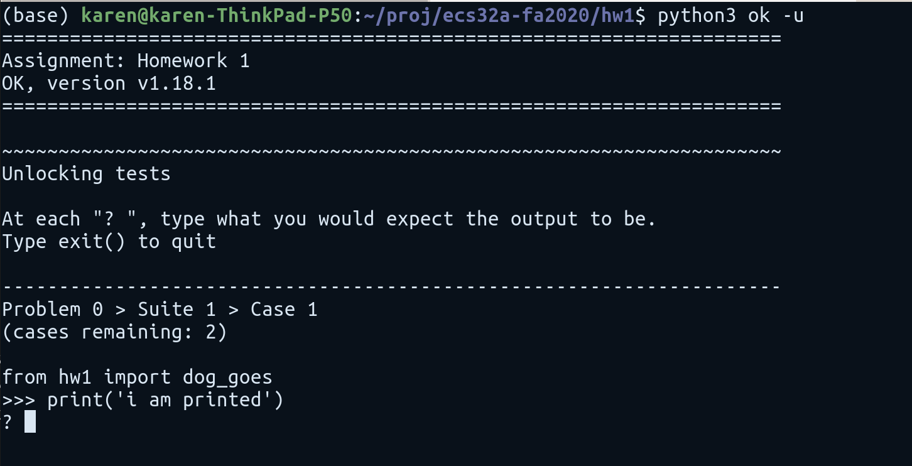

# Homework 1
> Due 10/20/2020 23:59:59 PDT
## Scope

1. String Manipulation
2. Arithmetic
3. Control
    - If else statement
4. While/For Loop

## Homework Submission

### New Features: Locked Tests

**Important**:  In this homework, you have locked tests.
To unlock these tests, you must run

```python3 ok -u```

and answer the **question**.




**Important**:  Do not modify the `tests` folder or any other file except `hw1.py`.
The tests are provided to you as a courtesy.  The autograder will run a more comprehensive tests.

**Important**:  You are welcome to collaborate.  But please complete the homework assignments by yourself and refrain from sharing answers.  We have a very effective program to check for plagarism.

### Downloading Homework

1. You can download the assignment in the files tab on canvas.

- Open the location of the downloaded assignment
- Unzip the homework folder as `[UNZIP_LOCATION]/hw1/`
- run `cd [UNZIP_LOCATION]/hw1/`

2. Github Version:

- In your terminal, run
  `git clone https://github.com/Davis-ECS32A-Fall2020/hw1.git`
- enter your homework folder with
  `cd hw1`

### Testing with OK

Okpy uses doc string to test your code. For homework 0, there will only be one question, you can run

`python3 ok -q 1`

to verify your code is correct.

You can also test all questions with

`python3 ok`


### Submitting Homework

You can submit your assignment with

`python3 ok --submit`

After submission, ok will display a submission URL, which you can verify your submission.
